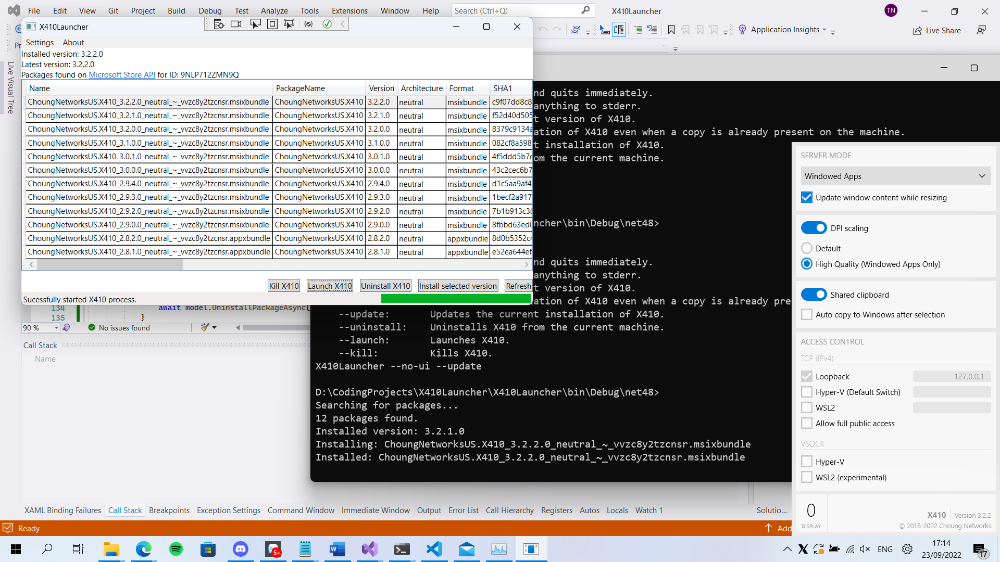

# X410Launcher
Launcher for X410 for users who cannot download it from the [Microsoft Store](https://apps.microsoft.com/store/detail/x410/9NLP712ZMN9Q).

# Features
- Install, uninstall, update X410.
- Launch, kill X410.

# Console
- To enable console mode, pass the argument: `--no-ui`.
- Available options:
   + `--help`: Prints this help and quits immediately.
   + `--silent`: Prevents printing anything to stderr.
   + `--install`: Installs the latest version of X410.
   + `--force`: Forces the installation of X410 even when a copy is already present on the machine.
   + `--update`: Updates the current installation of X410.
   + `--uninstall`: Uninstalls X410 from the current machine.
   + `--launch`: Launches X410.
   + `--kill`: Kills X410.

# Disclaimer
Use this at your own risk. I'm not responsible for your usage of this application.